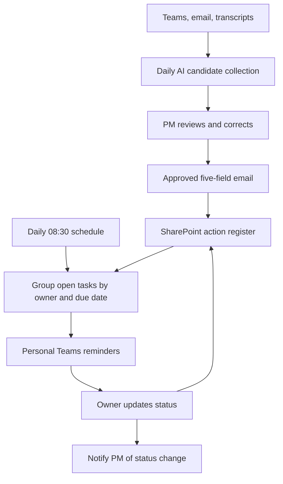

# ActionFlow — human-reviewed action collection & follow-up

**Eran Bloom | Business Operations, Revenue Operations & AI Automation**

A runnable portfolio reconstruction of a workflow I designed and implemented using Microsoft Copilot, Power Automate, SharePoint, Outlook, and Teams. It turns distributed commitments into a manager-reviewed action register and targeted daily follow-ups.

> Original implementation described by Eran Bloom. This repository is a new, AI-assisted reconstruction using synthetic data. Original tenant connections, exported flows, screenshots, and source code are unavailable. It is not a deployable Microsoft solution export. No former-employer data is included.

## Run the demo

No Microsoft account, API key, npm packages, or paid AI service required.

**Fastest preview:** double-click `standalone-demo.html` after extracting the ZIP. It bundles the same demo into one self-contained file. For the modular source demo, follow the server instructions below.

1. Download or clone the repository.
2. Open a terminal in its folder.
3. Run `python3 -m http.server 8000 --bind 127.0.0.1` (Windows: `py -m http.server 8000 --bind 127.0.0.1`).
4. Open **http://localhost:8000**.

A static web server is needed for JavaScript modules; double-clicking `index.html` is not supported. To verify the rules with Node.js 20 or later, run `npm test`. Python runs the demo server; Node runs the tests. Neither needs external dependencies.

## Run the automation rules outside the UI

With Node.js 20 or later:

```bash
node cli.js sample-reviewed-email.json 2026-10-05 > result.json
```

This imports a synthetically approved email, creates a register, and outputs owner-grouped reminder payloads and PM exceptions as JSON. It does not send messages. The CLI starts fresh on each invocation; the approval flag in a file is a demo process assertion, not authenticated PM authorization.

## A two-minute walkthrough

1. Read the synthetic chat, email, and transcript evidence. Click **Replay sample AI output**.
2. Review the four candidates. Notice the fourth has no owner, email, or deadline. Keep it to demonstrate the exception queue, or fill in the details.
3. Click **Approve list & prepare email**. Inspect the five-field format. Editing a candidate or the email invalidates approval.
4. Click **Simulate sent-email import**. Four rows enter the shared register. Click again to demonstrate safe handling of the same email retry.
5. Preview reminders for **2026-10-05**. Maya gets today's task and an upcoming task; Daniel gets an overdue task. Incomplete routing details go to the PM exception queue.
6. Set a task to **Completed**. See the PM notification log and its removal from the reminder preview.
7. Change the reminder date to explore the seven-day window. Download the register as JSON if useful.

## What is working and what is simulated

| Component | This repository | Original workflow described |
|---|---|---|
| Source collection | Five synthetic source records | Daily tenant-scoped Teams, emails, meeting transcripts |
| AI extraction | Fixed candidate replay; reusable prompt supplied | Scheduled Copilot prompt produced consolidated candidate list |
| Human review | Editable fields, removal, explicit approval, approval invalidation | PM reviewed and edited before emailing the team |
| Email handoff | Real formatting, strict parsing, validation, duplicate protection | Sent email with action/action items in subject triggered import |
| Shared register | In-memory browser table; optional JSON download | SharePoint list with five fields plus Status |
| Daily reminders | Real urgency grouping and per-owner message previews | Power Automate schedule at 08:30; personal Teams bot messages |
| Status updates | Real change events and PM notification preview | SharePoint status change notified the PM |

There is no live AI inference, scheduled background execution, authentication, durable database, Microsoft connector, or message delivery in this demo. Browser refresh resets the state. The demo approval switch illustrates a process gate; it is not a security boundary.

## Why this design

The difficult handoff was between natural-language extraction and deterministic automation. The five-field contract keeps parsing predictable, exposes missing information, and gives the PM a meaningful review point. A shared register makes accountability visible. Per-owner reminders reduce fragmented follow-up. Status-change notifications close the loop with the manager.

### Architecture



### Core contract

```text
Action: Complete the pipeline hygiene report | Owner: Maya Chen | Start date: 2026-10-02 | End date: 2026-10-05 | Owner's email address: maya.chen@example.com
```

Dates use `YYYY-MM-DD`. Missing values use exactly `missing information`. Start date defaults at collection time; status defaults to `Not started`. Missing email or due date blocks reminder routing, not register creation. Completed and cancelled tasks are suppressed. Upcoming means day +1 through day +7 inclusive. Date comparisons use calendar dates, not 24-hour elapsed time, to avoid daylight-saving boundary errors.

## Evidence of capability

- Business workflow design spanning AI, human review, structured data, and follow-up.
- AI prompt specification with source grounding and explicit missing-value policy.
- A deterministic interface between probabilistic AI output and downstream automation.
- Reusable and tested parsing, calendar rules, status events, and retry handling.
- Microsoft reconstruction guidance separating platform setup from portable business rules.

**Attribution:** workflow concept and original Microsoft implementation by Eran Bloom; this portfolio code and documentation were created with AI coding assistance. This project demonstrates the described architecture and functioning reconstructed rules. It does not independently verify the original implementation or establish quantified business outcomes.

## Files

| File | Purpose |
|---|---|
| `index.html`, `style.css`, `app.js` | Interactive portfolio demo |
| `standalone-demo.html` | One-file, double-click preview generated from the modular source |
| `cli.js`, `sample-reviewed-email.json` | Local command-line automation example |
| `core.js` | Reusable pure business rules |
| `fixtures.js` | Synthetic evidence and fixed candidate replay |
| `tests/core.test.js` | Behavioral verification |
| `prompts/action-extraction.md` | Reconstructed daily AI prompt and evaluation plan |
| `docs/microsoft-implementation.md` | SharePoint schema and four-stage Microsoft rebuild guide |
| `docs/github-guide.md` | First-time upload and optional demo publishing |
| `docs/portfolio-story.md` | Project explanation for recruiters and interviews |

## Limitations and production work

Duplicate protection handles a retry of the same email ID and identical lines in one email. It does not identify the same commitment in different emails; production needs a durable source/action identity and a reviewer-controlled merge/update policy. Browser state is single-user and transient. Live integrations need authenticated approvals, least-privilege source access, durable storage, concurrency control, retries, monitoring, owner identity resolution, and delivery logs. Resolve incomplete records through a PM correction view; do not fabricate details. See the Microsoft guide.

## License

MIT — see `LICENSE`. Microsoft product names are references to the original architecture; this project is not affiliated with Microsoft.
